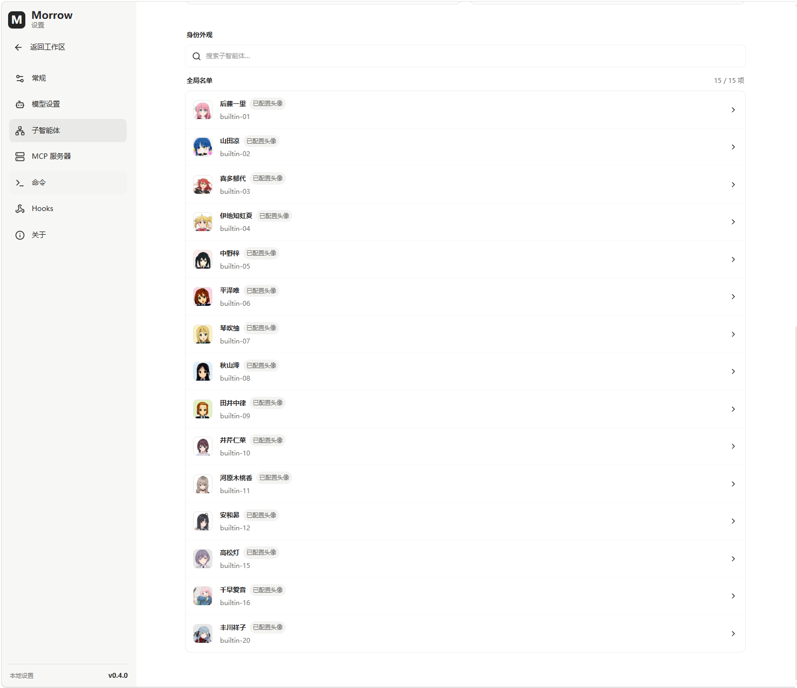

<div align="center">

# Morrow

**A local-first coding agent with CLI, Web, and multi-agent collaboration.**

[](https://github.com/catDforD/morrow/releases)
[](LICENSE)
[](Cargo.toml)

**English** · [简体中文](README.zh-CN.md)


</div>

Morrow connects your OpenAI-compatible Chat Completions endpoint to a Rust agent runtime. Read and edit code, run commands with permission controls, and resume project sessions from the CLI or browser dashboard. Web sessions also support background subagents for exploration, planning, implementation, and review.

[Quick start](#quick-start) · [Multi-agent collaboration](#multi-agent-collaboration) · [Configuration](#configuration) · [Development](#development)

## Features

- **CLI and Web** — one-shot prompts, an interactive REPL, and a browser dashboard share one runtime; JSONL output supports automation.
- **Model and tool integration** — OpenAI-compatible models, built-in file/search/shell tools, and MCP over stdio or Streamable HTTP.
- **Multi-agent collaboration** — background exploration, planning, implementation, and review with configurable roles, names, and avatars.
- **Persistent context** — project-scoped sessions, resumable subagents, and automatic context compaction.
- **Controlled execution** — permission profiles, approval queues, project instructions, and lifecycle hooks for verification.

## Installation

macOS and Linux:

```bash
curl -fsSL https://raw.githubusercontent.com/catDforD/morrow/main/install.sh | sh
morrow init
```

Pin a version or install directory with `MORROW_VERSION` / `MORROW_INSTALL_DIR`. On Windows, download `morrow-x86_64-pc-windows-msvc.zip` from Releases, extract `morrow.exe` and `morrow-rg.exe` together, and add that directory to `PATH`.

From source:

```bash
cargo install --git https://github.com/catDforD/morrow --locked -p agent-cli
```

## Quick start

```bash
morrow "summarize this repository"   # one-shot
morrow                               # interactive REPL
morrow server                        # web dashboard on 127.0.0.1:3000
```

Run these commands from your project directory. For Web, open the login URL printed in the terminal; it sets an `HttpOnly` session cookie. The server defaults to `127.0.0.1:3000` and can start without model configuration so you can add a provider in **Settings → Models**.

Web permissions are selected per turn, defaulting to `workspace_write`. Use `--permission-ceiling` (or `[server] permission_ceiling`) to cap that choice. `[permissions]` configures the CLI. Keep the server on localhost; `--no-auth` is available for local debugging.

## Multi-agent collaboration

In Web sessions, the main agent can delegate work to persistent subagents and collect their results. Each instance keeps its own conversation and execution history, and can continue running after the parent turn ends.

### Roles and identities

Open **Settings → Subagents** to configure your team:

| Setting | What you can customize |
| --- | --- |
| Role capabilities | Model and reasoning level, additional instructions, timeout, and maximum tool rounds for each role |
| Identity and appearance | A searchable global roster with editable names and PNG/JPEG/WebP avatars; add or remove entries and restore the default roster |

Roles determine tools and permission ceilings; the roster supplies display names and avatars. Creating a roster entry makes an identity available for future tasks. The main agent starts an actual task by spawning a subagent in a conversation.

<p align="center">
  
</p>

*Example of a customized roster. Names and avatars are editable in Settings.*

| Role | Typical work | Tool access |
| --- | --- | --- |
| `explore` | Investigate code and locate relevant files | Read, list, search; shell denied |
| `plan` | Analyze requirements and propose an implementation | Read, list, search; shell denied |
| `worker` | Implement changes | File reads/writes, patches, shell with approval |
| `reviewer` | Review changes and run checks | Read, list, search, shell with approval; no file-write tools |

For example, ask the main agent:

> Have explore locate the code for this issue, then ask plan for an implementation plan. Let worker make the changes, and have reviewer check the diff and run the relevant tests. Summarize the changes and test results.

### Follow tasks in the dashboard

Open the session's **Subagents** inspector to view status, messages, tool activity, and results. Send follow-up work to an idle or interrupted instance using its existing context, cancel an active task, or delete an inactive instance. Parent and subagent approval requests appear in the same queue with their source identified.

Each session supports **up to 8 persistent instances and 4 concurrent runs**. Reads can proceed in parallel; parent file writes and shell commands, worker runs, and approved reviewer commands share a workspace write lock. Access remains bounded by the parent's permissions, the role ceiling, and tool filters. Subagents have no MCP or further-delegation tools.

The CLI provides temporary, synchronous read-only delegation through `delegate_task`. Persistent task management and the inspector are available in Web sessions.

<details>
<summary>Runtime settings and persistence</summary>

- Persistent tasks use `spawn_subagent`, `send_subagent`, `inspect_subagent`, `wait_subagents`, and `cancel_subagent`.
- Each role accepts up to 4,000 characters of additional instructions, a 30–1,800 second timeout, and 1–99 tool rounds. Role settings and identity names are captured when an instance is created.
- Settings live in `~/.morrow/subagents.json`; task histories live in `~/.morrow/subagent-sessions/<workspace-scope>/<session>/`.
- In-workspace writes by subagents are auto-approved regardless of `workspace_write_require_approval`. Shell commands require approval when allowed by the parent profile. Approved file changes are revalidated before writing.
- On restart, unfinished runs become `interrupted`; pending approvals and locks are cleared. Continue an instance explicitly to resume work.
- At 16 MiB, the event log stops retaining streaming deltas but continues recording messages, tools, approvals, and terminal events. Model credentials stay in memory during a run.

</details>

## Configuration

`morrow init` writes `~/.morrow/config.toml` and prompts for an API key. Lookup order: `--config` → `morrow.toml` in the current directory → `~/.morrow/config.toml`.

```toml
[model]
base_url = "https://api.openai.com/v1"
model = "gpt-4.1"
api_key_env = "OPENAI_API_KEY"
context_window_tokens = 128000
reserved_output_tokens = 8192

[permissions]
mode = "read_only"
shell = "deny"
```

Set `context_window_tokens` to your model's supported context size; it is required for CLI configuration. An inline `OPENAI_API_KEY` wins when present; otherwise Morrow reads the `api_key_env` variable. Never commit a config containing a real key.

Web settings for models, MCP servers, commands, and subagents are managed in the dashboard and stored under `~/.morrow/`. See [`morrow.example.toml`](morrow.example.toml) for all options, including context compaction tuning.

### Project instructions

Morrow reads `AGENTS.md` from the workspace root and appends it to the system prompt for the main agent and all subagents. The file is re-read on every turn (mtime-cached), so edits take effect on the next turn without restarting. Each turn's system prompt also ends with an `<environment>` block (workspace root, OS/arch, current date, and the current git branch when available). `AGENTS.md` cannot grant tool access beyond the active permission profile, and it is sent to your model provider — don't put secrets in it.

### MCP tools

Register stdio and Streamable HTTP MCP servers in config; their tools are exposed as `mcp__server__tool`:

```toml
[mcp_servers.filesystem]
command = "npx"
args = ["-y", "@modelcontextprotocol/server-filesystem", "."]
enabled = true
```

MCP tools that the server does not mark with `readOnlyHint` require per-call approval by default; set `require_approval = false` on a server to opt out. Review server commands and endpoints before enabling them or disabling approval.

Use `[tools] allow` / `deny` in `morrow.toml` to restrict which tools the main agent sees at all. Entries match built-in tool names exactly, a whole MCP server (`mcp__filesystem`), or a prefix wildcard (`mcp__filesystem__*`); `deny` wins over `allow`, and an empty `allow` list allows everything. Skipped MCP tools are reported as startup diagnostics.

### Policy hooks

Hooks run at `before_prompt`, `before_tool`, `permission_request`, `after_tool`, `after_turn`, and compaction boundaries. User-level hooks live in `~/.morrow/hooks.toml`; project hooks live in `<workspace>/.morrow/hooks.toml` and are **disabled until you run `morrow hooks trust`** for that exact configuration. Trust is pinned to its SHA-256 fingerprint and can be removed with `morrow hooks revoke`. Hooks execute with your user permissions; review their commands before trusting them.

An `after_turn` hook runs when the model declares the turn complete, before the turn is accepted. It receives the final text and a turn summary, and answers `{"decision": "complete" | "continue" | "fail"}`: `continue` feeds `additional_context` back into the conversation for one more model call (at most 3 times per turn, then the turn completes with a warning), `fail` fails the turn with the given reason. For example, a verification gate that reruns the test suite:

```toml
[[hooks]]
id = "verify-tests"
event = "after_turn"
command = ["/bin/sh", "-c", "cargo test --workspace >/dev/null 2>&1 && printf '%s' '{\"decision\":\"complete\"}' || printf '%s' '{\"decision\":\"continue\",\"additional_context\":[\"cargo test is still red; fix the failures before finishing\"]}'"]
```

### Web custom commands

**Settings → Commands** manages slash commands stored in `~/.morrow/commands/*.md`. Type `/` in the composer to search; `$ARGUMENTS` is replaced with the supplied args.

## Permissions

| `permissions.mode` | Behavior |
| --- | --- |
| `read_only` | Write tools denied |
| `workspace_write` | File changes stay in the workspace and run without approval (see `workspace_write_require_approval` below to restore per-change prompts) |
| `danger_full_access` | File I/O may leave the workspace |

| `permissions.shell` | Behavior |
| --- | --- |
| `deny` | Shell denied |
| `prompt` | Shell needs approval |
| `allow` | Shell runs without a prompt |

Defaults from `morrow init`: `read_only` + `shell = "deny"`. Override per run with `--permission` / `--allow-shell`:

```bash
morrow --permission workspace-write "update the README"
morrow --allow-shell "run the test suite and explain failures"
```

Shell policy is an approval boundary, not an OS sandbox — an approved command runs with your user permissions. Use an external sandbox when stronger isolation is required.

In `workspace_write` mode, writes inside the workspace are auto-approved and writes outside it are rejected. Shell commands follow the shell policy; non-read-only MCP tools require approval by default. To require approval for each main-agent file change:

```toml
[permissions]
workspace_write_require_approval = true
```

## Sessions

Named, project-scoped sessions persist under `~/.morrow/sessions/`:

```bash
morrow --session work "continue the refactor"
morrow --session work --reset-session "start over in the same project"
morrow session list
morrow session show work
morrow session export work --output work-session.json
morrow session rename work backend-refactor
morrow session delete backend-refactor
```

Useful REPL commands: `/status`, `/permissions ...`, `/compact`, `/reset`, `/exit`. The legacy `--thread` / `--reset-thread` aliases still work; prefer `--session` / `--reset-session`.

## Automation

```bash
morrow --jsonl "inspect this crate" > events.jsonl
```

JSONL mode requires a prompt and is unavailable in interactive mode or with session subcommands.

## Development

Crate boundaries, turn lifecycle, and extension points: [`ARCHITECTURE.md`](ARCHITECTURE.md).

This README covers the Rust workspace in `crates/`. The experimental next-generation runtime has its own [vnext guide](vnext/README.md).

<p align="center">
  
</p>

<details>
<summary>Workspace crates</summary>

| Crate | Responsibility |
| --- | --- |
| `agent-cli` | CLI, REPL, JSONL, session/hooks commands, server wiring |
| `agent-config` | Config loading |
| `agent-core` | Turn execution, ports, middleware, event streams |
| `agent-eval` | Deterministic regression suite for the agent loop |
| `agent-hooks` | Command hooks and middleware adapters |
| `agent-model` | OpenAI-compatible client and streaming |
| `agent-protocol` | Shared protocol types |
| `agent-runtime` | Sessions, compaction, workspace, turn helpers |
| `agent-server` | HTTP/WebSocket browser dashboard |
| `agent-sandbox` | Permission evaluation |
| `agent-tools` | Built-in file and shell tools |

</details>

```bash
cargo build --workspace
cargo test --workspace
cargo fmt --check
cargo clippy --workspace --all-targets -- -D warnings
cargo run -p agent-eval -- run   # agent loop regression suite

cargo run -p agent-cli -- "hello"
cargo run -p agent-cli -- server
```

Web dashboard development uses Vite's API/WebSocket proxy. Start the local backend in one terminal:

```bash
cargo run -p agent-cli -- server --no-auth
```

Then start the frontend in another:

```bash
cd crates/agent-server/web
pnpm install --frozen-lockfile
pnpm dev
```

Tagging the workspace version (e.g. `v0.4.0`) triggers GitHub Actions to publish CLI archives and checksums.

## Uninstall

Remove the CLI and its bundled search binary from the installation directory:

```bash
rm -f ~/.local/bin/morrow ~/.local/bin/morrow-rg
```

Local sessions, configuration, and keys remain under `~/.morrow/`. Delete that directory only if you also want to remove those data.

## License

[MIT](LICENSE) © 2026 Gargantua
