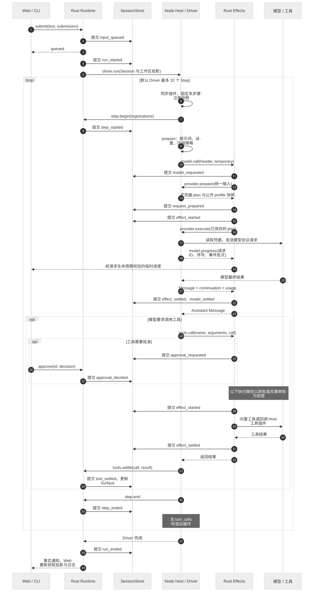

# Morrow vNext：新版 Agent 架构导读

本文依据 **2026-09-07 的当前实现**，覆盖 `vnext/` 独立工程。入口程序为 `morrow-next`，默认数据目录为 `~/.morrow-vnext/`。根目录 `crates/agent-*` 属于旧实现；新版有自己的 Rust workspace、Node Host 和 Web 应用。

阅读路线：先看整体关系和术语，再沿一次请求理解执行过程，最后阅读事实、上下文和插件机制。文中的文件链接均指向当前源码。

- [1. 整体设计](#overall)
- [2. 代码地图与核心术语](#map)
- [3. 从启动到一次 Agent 执行](#execution)
- [4. 事实日志与状态回放](#facts)
- [5. 上下文如何组织和压缩](#context)
- [6. Cordis 插件如何扩展 Agent](#plugins)
- [7. Web 与插件如何协作](#web)
- [8. MCP 与子智能体](#extensions)
- [9. 失败、取消和恢复](#recovery)
- [10. 当前扩展边界](#boundaries)
- [11. 开发、验证与源码阅读路线](#development)

<a id="overall"></a>

## 1. 整体设计

**Rust 管理可信状态与执行边界，Node 插件决定 Agent 的具体行为，React 展示会话并承载前端扩展。**

一个服务实例包含一个 Rust 进程、一个受它监督的 Node Host 进程，以及连接服务的浏览器。多个 Session 共享这两个服务进程；每个 Session 拥有独立事实日志和独立的 Host 插件上下文。



[编辑图源](diagrams/overview.mmd)

| 层次 | 负责的事情 | 关键设计理由 |
| --- | --- | --- |
| Rust 内核 | 输入排队、Run/Step 约束、事实落盘、审批、模型与工具执行边界、子会话 | 把可恢复状态和执行约束集中到一个权威实现 |
| Node Host | 加载 Cordis 插件，提供默认 Agent 循环，调用工具、模型和策略扩展 | 业务能力可以通过 JavaScript/TypeScript 插件迭代 |
| Web | 聊天、审批、设置、事实查看，以及插件页面和面板 | 保留应用外壳，为新功能提供展示入口 |

默认 ReAct 循环位于 [defaults.ts](../packages/host/src/defaults.ts) 的 `agent()` 中。Rust 的 [runtime.rs](../crates/kernel/src/runtime.rs) 管理一个 run 何时开始、结束，以及操作是否仍属于有效执行。理解这两个职责，有助于判断新功能应放进插件还是内核。

<a id="map"></a>

## 2. 代码地图与核心术语

```text
vnext/
├── crates/kernel/src/       Rust 内核、CLI 与 HTTP 服务
│   ├── main.rs              启动、进程监督、命令入口
│   ├── protocol.rs          Fact、Message、PreparedRequest 等协议
│   ├── projection.rs        状态校验与统一 reducer
│   ├── store.rs             JSONL 存储、回放与中断收尾
│   ├── runtime.rs           Session 编排、Host RPC、插件和子会话
│   ├── effects.rs           模型请求、工具执行、审批和 SSE
│   ├── rpc.rs               Rust ↔ Node 双向 JSON-RPC
│   └── server.rs            HTTP、WebSocket、Web 静态资源
├── packages/
│   ├── sdk/src/             插件 API、注册表、RunContext、MCP 客户端
│   ├── host/src/            Cordis 加载器、默认插件、RPC 入口
│   └── web/src/             React 外壳、数据接入、Client 插件宿主
├── vendor/                  固定版本的 Cordis / Cosmokit
├── examples/                可运行的 Host + Client 插件示例
├── tests/                   Node、跨进程和浏览器回归
├── scripts/                 构建、协议类型生成、插件与应用打包
└── docs/                    本文及后续设计分析
```

| 术语 | 在当前实现中的含义 |
| --- | --- |
| Session | 持久化会话，包含多次用户输入、执行历史、插件绑定和插件状态 |
| Submission | 一次提交的 ID；重复 ID 与相同文本用于识别重复提交 |
| Run | 消费一次输入的执行；一个 Session 同时最多一个 run |
| Step | Driver 声明的一段执行边界；默认循环每次模型调用及其工具回灌构成一步 |
| Fact / Record | Fact 是语义事实；Record 为它附加序号、协议版本和哈希链信息 |
| Projection | 从事实归约出的当前状态，包括上下文、请求、审批、插件等 |
| Surface | 当前模型上下文的有序消息节点 ID 列表 |
| Effect | 一次经过内核执行管线的模型或工具操作，有开始和结算边界 |
| Registration | 插件贡献的注册信息，记录名称、种类、所有者、作用域和代次 |
| Fiber | Cordis 管理的插件生命周期单元，承载注册、依赖和清理操作 |
| Epoch | 本次 Host 连接的身份；重新连接后变化，用于拒绝旧执行句柄 |

`seq` 与 `revision` 用途不同：前者随每条事实增长；后者在上下文引用变化时增长，用来校验上下文替换是否基于正确版本。

<a id="execution"></a>

## 3. 从启动到一次 Agent 执行

### 3.1 启动装配

[main.rs](../crates/kernel/src/main.rs) 读取工作区、数据目录和模型配置，创建 `Runtime`，启动本地 Axum 服务，再启动 Node Host。Host 连接 `/host`，通过 `host.ready` 握手取得 epoch。Rust 等待 Host 就绪后输出浏览器地址或执行 CLI 输入。

Rust 和 Host 使用独立于浏览器的连接令牌。原生模型请求使用 Rust 中的 `OPENAI_API_KEY`，启动 Node 子进程时会移除这个环境变量。浏览器接收自己的临时访问令牌。

Host 退出后由启动器尝试重新拉起。新进程需要重新加载插件对象，持久化状态从 Rust 读取。

### 3.2 默认执行路径

下面展示正常完成路径。每次“提交事实”都经过持久化；多个工具的执行可以并发，图中用一项工具调用表示。



[编辑图源](diagrams/turn-sequence.mmd)

1. **接收输入。** `Runtime.submit()` 校验 submission ID，保存 `input_queued`，返回排队回执。
2. **领取输入。** `drain()` 按事实日志中的提交顺序领取未消费输入，记录 `run_started`。同一 Session 已有活动 run 时，其他 drain 不会再启动一个。
3. **选择 Driver。** Host 加载有效插件，选择名为 `default` 的 driver，并将它固定到本次 run 结束。
4. **开始 Step。** `run.beginStep()` 同步插件，固定本步注册快照，然后让 Rust 记录 `step_started`。
5. **准备请求。** `run.prepare()` 执行 policy 链，形成模型、工具列表、系统提示和临时消息。
6. **调用模型。** Rust 创建 `PreparedRequest` 并落盘，再执行模型调用。`openai` Provider 走原生 HTTP，其余 Provider 根据本步注册快照回调 Host。
7. **执行工具。** 默认 driver 遍历模型的 `tool_calls`。Rust 检查注册、审批及执行状态，再执行内置工具或回调插件。Driver 最后调用 `run.settle()` 将工具结果回灌上下文。
8. **继续或结束。** 记录 `step_ended`；有工具调用则进入下一步，无工具调用则结束 run。默认上限为 32 步。

`effect_settled` 表示操作结果已记录，`tool_settled` 表示结果已转为模型上下文中的工具消息。将两个边界分开，使中断恢复能利用已有结果补齐消息。

### 3.3 为什么 RPC 必须允许双向嵌套调用

典型链路是：Rust 调用 Host 的 Driver，Driver 调用 Rust 的工具接口，Rust 又回调 Host 的插件工具，插件工具还可能调用 Rust 的内置文件工具。

[rpc.rs](../crates/kernel/src/rpc.rs) 收到请求后派发独立异步任务，读取 WebSocket 的循环继续处理消息；请求通过 ID 匹配响应。这样等待某个调用时，反向请求仍能被处理。Host 侧对应实现位于 [rpc.ts](../packages/host/src/rpc.ts)。

<a id="facts"></a>

## 4. 事实日志与状态回放

### 4.1 写入顺序与权威状态

[SessionStore::commit](../crates/kernel/src/store.rs) 按以下顺序工作：

```text
校验 Fact → 构造带序号和哈希的 Record → 追加 JSONL
         → sync_data 成功 → 更新 Projection → 返回已提交记录
```

调用者随后广播事实通知。若落盘失败，内存投影保持原状态，writer 被标记为不可继续写入，避免内存状态领先于可靠日志。

[Projection](../crates/kernel/src/projection.rs) 同时用于实时更新和打开会话时的回放。回放按顺序校验协议、序号、哈希和状态约束，然后应用同一套 reducer。



[编辑图源](diagrams/context-views.mmd)

回放重新计算当前状态，不会重新执行模型请求、Shell 或插件工具。流式 `delta` 是临时显示通知；模型最终结果通过事实保存。

### 4.2 主要事实分组

| 分组 | 代表事实 | 记录的含义 |
| --- | --- | --- |
| 会话与执行 | `session_opened`、`input_queued`、`run_started/ended`、`step_started/ended` | 工作区、父会话、输入消费与执行边界 |
| 请求与操作 | `request_prepared`、`effect_started/settled` | 请求输入和操作结果 |
| 消息与上下文 | `model_settled`、`tool_settled`、`context_appended`、`surface_replaced` | 消息进入上下文及上下文的替换 |
| 审批 | `approval_requested/decided` | 请求批准与用户决定 |
| 插件 | `plugin_defined/trusted/bound` | 不可变版本、信任与启停绑定 |
| 插件数据 | `plugin_state_set/deleted`、`plugin_event` | 命名空间内的状态变更和自定义记录 |

完整协议在 [protocol.rs](../crates/kernel/src/protocol.rs)。`plugin_event` 可携带业务事件，但当前 reducer 不根据它自动计算业务状态；需要恢复到 `plugin_state` 的数据应通过 `setState()` / `deleteState()` 写入。

### 4.3 数据存放位置

```text
~/.morrow-vnext/
├── sessions/
│   ├── default.jsonl
│   ├── child-<uuid>.jsonl
│   └── workspace-<工作区路径哈希>.jsonl
└── plugins/<版本哈希>/
    ├── manifest.json
    ├── host.mjs
    └── client.mjs           插件有 Client 部分时存在
```

`_workspace` 是 API 中代表工作区级插件状态的特殊名称，实际映射到带路径哈希的日志文件。打开日志时会校验所属工作区，并获取文件锁，防止两个进程同时操作同一日志。

当前日志与完整投影在打开后驻留内存，尚未实现分段日志或持久化快照加速。较长会话的启动成本会随历史增长。

<a id="context"></a>

## 5. 上下文如何组织和压缩

### 5.1 完整历史、消息节点与 Surface

这三者各有用途：事实日志保留发生过的事情，`nodes` 保存消息内容，`surface` 选择当前提供给模型的消息及其顺序。

例如已有以下节点：

| 节点 | 内容 |
| --- | --- |
| `m1` | 用户任务 |
| `m2` | Assistant 发出的工具调用 |
| `m3` | 对应工具结果 |
| `m4` | Assistant 后续回复 |

压缩前为 `surface = [m1, m2, m3, m4]`。将前三项归纳为摘要 `s1` 后，保存一条 `surface_replaced`，得到 `surface = [s1, m4]`。原节点仍在 `nodes` 中，`s1.covers` 记录它覆盖的节点；多次压缩时还会传递已有覆盖关系。

替换必须满足当前 revision 正确、起止节点构成连续区间、替换后的消息链合法。尤其不能把 Assistant 工具调用和所需工具结果拆开。

### 5.2 当前默认压缩策略

压缩策略实现在 [defaults.ts](../packages/host/src/defaults.ts) 的 `compact()` 中：

- `90-compaction` 统计当前 Surface 消息序列化后的字符数，超过 `60_000` 时尝试压缩，保留至少末尾 4 条消息，并选择合法工具边界。这是字符长度阈值，不是 token 预算。
- 主请求遇到匹配上下文超限的错误时，尝试保留至少末尾 2 条消息的压缩，然后重试一次主请求。
- 摘要也通过 `run.model()` 执行，使用 `purpose: 'summary'`，工具列表为空，有完整的请求与结果事实。
- 摘要结果由 `run.replace()` 以用户角色的“Earlier conversation summary”消息写入 Surface，并记录 `source_request`。

因此，新摘要可以追溯到它使用的原始消息和摘要请求。压缩策略可以改在 Host 插件层，连续替换和消息合法性由 Rust 校验。

### 5.3 一次模型请求如何重建

`PreparedRequest` 固定保存：此次选用的 `surface`、上下文 revision、`temporary` 消息、请求 header、本步注册快照，以及生成的请求 `body`。

`Projection.reconstruct()` 按请求保存的节点 ID 读取消息，追加临时消息，再通过统一规则构造 Provider body。当前 Surface 后来即使压缩了，旧节点仍然可用，因此历史请求仍可重建并与保存的 body 比较。

Web 聊天历史由 [Conversation.tsx](../packages/web/src/Conversation.tsx) 根据完整事实日志整理，模型输入使用 Surface。压缩后用户仍能看到原对话；临时提示消息可以影响某次模型请求而不成为聊天记录。

<a id="plugins"></a>

## 6. Cordis 插件如何扩展 Agent

### 6.1 框架与 Morrow 协议的分工

Cordis 提供 `Context`、服务依赖注入、插件 `Fiber` 和资源生命周期。Morrow 在它上面实现自己的贡献注册表、作用域优先级、RunContext，以及与 Rust 的通信协议。

插件通过 `ctx.morrow` 注册能力。注册所属的插件、版本、scope、epoch 和 generation 会进入 `Registration`。`ctx.effect()` 将注册和清理关联到插件生命周期，卸载时撤销贡献并取消对应的生命周期信号。

[loader.ts](../packages/host/src/loader.ts) 为每个 Session 建立一组上下文：

```text
application：内置插件
  └── workspace：当前工作区插件
        └── session：当前会话插件
```

Host 的注册表按这个顺序合并同种类、同名称的贡献，最近一层覆盖祖先层，同层重复注册报错。工作区插件会在各个 Session 的 Host 上下文中实例化，不能把它的内存对象当作跨会话单例。需要持久化的数据应走状态 API。

使用 Cordis 服务注入时，插件可声明 `provide` 和 `inject`；加载器提前发现提供的服务，并建立作用域隔离，使 Cordis 能管理依赖可用性。固定框架源码与来源说明见 [vendor/README.md](../vendor/README.md)。

### 6.2 已有扩展接口

| API | 用途 | 调用位置 |
| --- | --- | --- |
| `ctx.morrow.tool()` | 新工具，也可组合调用内置工具 | Driver 请求工具后，由 Rust 校验并回调 |
| `ctx.morrow.model()` | 自定义模型 Provider | `header.provider` 匹配注册名称时调用 |
| `ctx.morrow.driver('default', ...)` | 替换执行循环与停止条件 | 每个 run 启动时选择 |
| `ctx.morrow.policy()` | 调整请求 header、临时消息，执行压缩等准备逻辑 | Driver 显式调用 `run.prepare()` 时 |
| `ctx.morrow.method()` | 向 Web 暴露当前插件的公开方法 | Client 通过 `invoke()` 调用 |
| `run.state/setState/deleteState()` | 读写插件自己的命名空间状态 | 工具、策略、公开方法等受支持上下文 |
| `run.emit()` | 写入带命名空间和版本的业务事件 | 作为通用 `plugin_event` 持久化 |

[SDK 源码](../packages/sdk/src/index.ts) 中，`RunContext` 还提供 `beginStep/endStep`、`model/tool/settle`、`append/replace`、`subagent` 等执行接口。后面这些接口要求活动 run；新 Driver 要遵守 Step 与工具消息配对约束。

Policy 按注册快照中名称排序执行，通过 `next()` 组成调用链。默认策略命名为 `10-prompt`、`20-settings`、`90-compaction`。自行编写 Driver 时，也要明确何时调用 `prepare()`。

### 6.3 插件版本与热变更



[编辑图源](diagrams/plugin-lifecycle.mmd)

一个 manifest 包含 `name`、`description`、Host 源码、可选 Client 源码和 `dependency_lock`。Rust 对序列化后的完整 manifest 计算 SHA-256，因此任一字段变化都可能产生新版本 hash。

`define` 保存待审阅版本，`trust` 记录对具体 hash 的信任，`activate` 写入启用绑定。工作区安装由 `promote` 将版本、信任和绑定写入工作区日志完成。依赖在开发时打包，加载阶段导入已保存 ESM，不执行 npm 安装脚本。

新工具、Provider 和 policy 在下一次 `beginStep()` 同步后进入注册快照。活动 Driver 固定到整个 run 结束，其所属插件的替换和卸载会延后；空闲会话可在绑定变更时同步。Host 与 Client 的生命周期彼此独立。

当前 Host 在一组绑定发生变化时，会重建未被活动 Driver 固定的已加载插件；插件作者需要通过生命周期管理连接和资源，不能依赖普通内存变量跨加载保持不变。

<a id="web"></a>

## 7. Web 与插件如何协作

Web 外壳位于 [main.tsx](../packages/web/src/main.tsx)，[useSession.ts](../packages/web/src/useSession.ts) 处理快照、事实日志、WebSocket 更新和 Client 生命周期。

主要入口是：

| 通道 | 用途 |
| --- | --- |
| `GET /api/session/:session` | 当前 Session 与工作区投影 |
| `GET /api/session/:session/facts` | 完整事实时间线 |
| `GET /api/session/:session/request/:id` | 保存的请求与重建结果 |
| `POST /api/session/:session` | `submit/cancel/approve`、插件管理、`resume/invoke` 等操作 |
| WebSocket `/events` | 事实通知、临时 delta、重同步和 Host 断开通知 |
| WebSocket `/host` | Node Host 的双向 RPC，使用独立认证 |

Web 收到事实通知后重新获取快照和日志；当前浏览器没有维护一份与 Rust 对等的完整 reducer。订阅缓冲落后时服务端发送 `resync`，浏览器重新取数。

Client 插件通过 [plugins.tsx](../packages/web/src/plugins.tsx) 注册 React 组件：

| 扩展 | 当前实际挂载位置 |
| --- | --- |
| `ctx.ui.panel(name, Component)` | 右侧详情中的“会话面板” |
| `ctx.ui.page(name, Component)` | 设置导航中的插件页面 |
| `ctx.ui.renderer(role, Component)` | 按 `user/assistant/tool` 等消息角色选择渲染组件 |

组件收到 `{ state, invoke, message }`。`state` 为该插件命名空间下的数据；`invoke(method, input)` 定位当前 Session、插件及版本注册的公开 Host method；消息 renderer 还收到 `message`。React 由宿主共享，可通过 `ctx.ui.react` 获取。

以 [项目统计 Host](../examples/project-stats.host.mjs) 和 [对应 Client](../examples/project-stats.client.mjs) 为例：Agent 调用 `project_stats` → Host 组合内置文件工具 → `setState('stats', result)` 写入事实 → Web 获取新投影 → 统计面板展示新数据。这个插件不需要修改 Rust 协议或 Web 外壳。

历史浏览和插件执行分别管理。发送输入或调用 `resume` 会恢复 Host 插件；浏览器在发送输入、激活插件或显式加载面板后启用 Client。当前“加载已信任面板”只启用浏览器侧，重启后公开方法的调用还需要 Host 已恢复。这是后续需要统一的装配入口。

组件渲染异常由局部错误边界显示，已经提交的 Host 状态继续保留。

<a id="extensions"></a>

## 8. MCP 与子智能体

MCP 适配在 [sdk/src/mcp.ts](../packages/sdk/src/mcp.ts) 中作为插件使用，支持 stdio 和 HTTP 传输。初始化和 `tools/list` 后，将远端工具注册为 `服务名__工具名`。默认只对标注 `readOnlyHint: true` 的工具免审批，其余调用经过 Rust 的审批与 effect 管线。

子智能体由 `run.subagent(prompt)` 创建。Rust 生成独立 `child-<uuid>` Session，记录 parent，复制父 Session 的插件版本、信任、绑定与初始插件状态，然后通过同一套输入和 Driver 执行链运行。工作区贡献仍通过工作区作用域获得。

父 Session 记录 `morrow.subagent/spawned` 事件；子 Session 的完整日志独立保存。当前返回值包含子会话 ID、outcome 和当前 Surface 消息，由默认工具调用回灌为父会话的工具结果。父取消会传到子任务，当前最多允许三层子任务嵌套。

<a id="recovery"></a>

## 9. 失败、取消和恢复

| 场景 | 当前处理方式 |
| --- | --- |
| 相同 submission ID 再提交相同文本 | 返回重复提交回执；同一 ID 换文本会报错 |
| 两个工具并发完成 | 各自记录结果；投影按模型发出调用的顺序将工具消息加入 Surface |
| 工具被拒绝 | 返回 `not_started` 结果；实际工具尚未派发 |
| 用户取消 | 取消 Rust token 并通知 Host；等待有限时间后仍未结束会断开 Host |
| Host 断开或执行中断 | 对未结算边界收尾，未知操作结果标记 `unknown`，保留已经提交的数据 |
| 结果已保存，但消息尚未回灌 | 从已完成的 effect 结果补齐 `model_settled` 或 `tool_settled` |
| 进程退出时 JSONL 留下无换行尾部 | 隔离为 `.torn-*` 文件，再恢复到完整记录边界 |
| 完整记录的哈希、协议或状态校验失败 | 拒绝打开该日志 |
| 写入失败 | 封闭当前 writer，投影不提前更新 |

恢复入口位于 [store.rs](../crates/kernel/src/store.rs) 的 `open()`、`recover()` 和 `finish_interrupted()`。打开历史时也会进行必要的中断收尾，但不启动用户 Host 插件。

`resume` 当前只恢复插件加载，不消费排队输入，也不自动重做中断操作。已有未消费输入由后续新的提交触发队列处理。`unknown` 表示无法确认外部操作结果，不能据此认定外部副作用已撤销；事实日志本身不提供外部系统的事务回滚。

<a id="boundaries"></a>

## 10. 当前扩展边界

设计新功能时，可按以下边界选择实现位置：

| 需求 | 当前适合的落点 |
| --- | --- |
| 新工具、知识检索、模型适配、请求准备策略 | Host 插件 |
| 规划或多阶段 Agent 执行 | 自定义 Driver，使用已有 RunContext API |
| 功能配置页、统计面板、消息展示 | Client 插件 + 公开 Host method |
| 新业务状态或事件 | 命名空间状态 API / `plugin_event` |
| 输入框扩展、侧栏按钮、工具栏等挂载位置 | 先扩展 Web 宿主插槽；目前只有 panel/page/renderer |
| Web 按钮发起 Agent 执行 | 需要给 Client API 补提交任务桥接；当前 `invoke` 的 RunContext 没有活动 run |
| 工具前后、回合前后的通用拦截 | 需要扩展宿主生命周期接口；当前 policy 聚焦请求准备 |
| 事实结构、审批语义、并发与恢复规则变化 | Rust 内核与共享协议 |

可信插件运行在普通 Node 或浏览器环境中，可使用这些环境自身的能力。通过 SDK 发起的模型、工具与状态操作进入内核记录；插件直接使用 Node 文件或网络 API 的操作不会自动获得同样的审批与事实记录。

内置文件工具校验工作区路径，Shell 工具设置工作目录并经过审批；当前系统没有为所有插件和 Shell 建立操作系统级隔离沙箱。多个 Session 共享 Node 进程，一个导致进程退出的插件会影响该 Host 中的其他 Session。

Web 保留原版布局，当前已接入外观、会话模型、插件管理等功能。旧版 MCP、Hooks 等配置页尚未全部迁移。后续增强应记录在单独设计文档中，并在实现后更新本导读。

<a id="development"></a>

## 11. 开发、验证与源码阅读路线

### 11.1 启动工程

需要 Rust 工具链、Node 24 和 pnpm 10.30.3。以下命令从仓库根目录开始：

```bash
cd vnext
pnpm install --frozen-lockfile
pnpm build
export OPENAI_API_KEY='你的 API Key'
export OPENAI_BASE_URL='https://api.deepseek.com/v1'
export OPENAI_MODEL='deepseek-chat'
cargo run --bin morrow-next -- --workspace .. serve --port 3001
```

打开终端打印的完整 `http://127.0.0.1:3001/#token=...` 地址。`--workspace` 指定 Agent 操作的项目，`--home` 可选择独立数据目录。新版使用这些参数和环境变量配置，不读取旧版 `morrow.toml`。

### 11.2 按问题阅读源码

| 想理解或修改什么 | 建议阅读顺序 |
| --- | --- |
| 一次输入怎样运行 | `runtime.rs: submit/drain` → `loader.ts: run` → `defaults.ts: agent` |
| 每次模型看到了什么 | `RunContext.prepare/model` → `effects.rs: model_call` → `Projection.reconstruct` |
| 压缩为什么不丢历史 | `defaults.ts: compact` → `RunContext.replace` → `Projection.validate/apply_validated` |
| 插件怎样注册和卸载 | `sdk/src/index.ts: Morrow/Contributions` → `loader.ts: sync` → Cordis Fiber |
| 浏览器面板为何更新 | `run.setState` → Rust `state.set` → `/events` → `useSession.ts` → `PluginView` |
| 重启后哪些事情会恢复 | `store.rs: open/finish_interrupted` → `loader.ts: resume/sync` |

### 11.3 验证与构建入口

| 命令或文件 | 验证的重点 |
| --- | --- |
| `cargo test --workspace` | 协议、投影、持久化、中断恢复与 SSE 等 Rust 行为 |
| `cargo fmt --check`、`cargo clippy --workspace --all-targets -- -D warnings` | Rust 格式与 lint |
| `pnpm check:types`、`pnpm typecheck` | Rust 生成的 TS 协议是否同步、应用类型检查 |
| `pnpm test` | Cordis 生命周期、作用域、policy 与 MCP |
| `pnpm eval` | 启动真实 Rust/Node，验证工具回灌、插件变更、压缩、取消和恢复 |
| `pnpm test:browser` | 实际浏览器中的插件信任、面板、重连与错误边界 |
| `scripts/package.mjs` | 打包 Rust、Node、Host、SDK、Cordis 与 Web 资源 |

上述命令在 `vnext/` 执行。首次跑跨进程或浏览器测试前，先执行 `pnpm build` 和 `cargo build --bin morrow-next`；浏览器测试还需要安装 Playwright Chromium。协议变化后用 `pnpm types` 重新生成 [SDK 协议类型](../packages/sdk/src/protocol.ts)。

开始新增功能时，可以先复制 `examples/project-stats.*.mjs` 的双端组织方式，再决定需要哪些注册接口和状态字段。涉及执行与恢复规则的变化，应同时补充相应 Rust 或跨进程回归案例。
